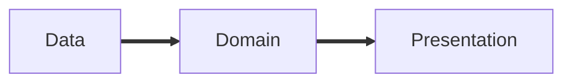

# Clean Architecture in Flutter
Uno schema visto e rivisto...

 

 

 
 
 

<v-clicks>

- Interazione con ciò che **non** è il nostro applicativo
- **Cuore** del nostro applicativo
- Interazione con l'**utente** del nostro applicativo

</v-clicks>

<!--
  Alzi la mano chi ha già visto questo schema a grandi linee o se ha già sentito parlare di questi tre vocaboli
  "DATA" quella parte di software che...
  "DOMAIN" ovvero il dominio dell'applicazione, i.e. le logiche più "base" dell'applicativo 
  "PRESENTATION" quanto più di vicino c'è al cliente

-->