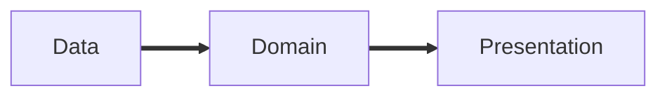

# Clean Architecture in Flutter
Uno schema visto e rivisto...

 

 

 
 
 

<v-clicks>

- Interazione con ciò che **non** è il nostro applicativo
- **Cuore** del nostro applicativo
- Interazione con l'**utente** del nostro applicativo

</v-clicks>

Sì, ok, belli gli schemi...

Bella la teoria ...

 

 

... ma quindi?

<!--
  Ecco se cercate su Google queste parole chiave... 800 risultati e molta "teoria".

  Oggi sicuramente vediamo un po' di teoria. Ma poi pensiamo alla pratica.

  Alzi la mano chi ha già visto questo schema a grandi linee o se ha già sentito parlare di questi tre vocaboli.

  "DATA" quella parte di software che integra software esterno all'app interna.

  "DOMAIN" ovvero IL CORE dell'applicazione, i.e. le logiche più "vicine" dell'applicativo.

  "PRESENTATION" quanto più di vicino c'è al cliente. Il _deliverable_, se vogliamo

-->