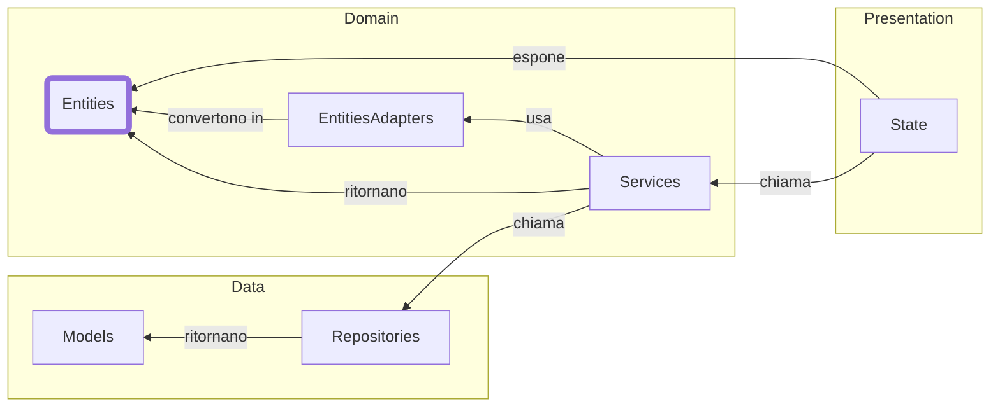

# Il Domain Layer
Il cuore della nostra applicazione

<!-- 
Snoccioliamo un po' di teoria per avvicinarci sempre di più alla pratica.
Innanzitutto va capito che ogni riquadro rappresenta una "categoria" di classi.
Guardiamo il riquadro più a sinistra: Entities. L'ho messo thick perché rappresenta
il vero cuore dell'applicazione. In un mondo ideale, sarebbe magnifico toccare queste classi il meno possibile.
Di fatto queste classi rappresentano il cuore dei requisiti e del dominio dell'applicativo che stiamo realizzando.

L'idea chiave per una buona architettura è quella di disaccoppiare il software al fine di:
  - iniettare questa classe tramite lo state presso il presentation layer
E CONTEMPORANEAMENTE
  - ottenere questa classe tramite risorse esterne con il data layer

Ormai abbiamo capito che le repository ci ritornano un oggetto che noi chiamiamo "Model" e che rappresenta bene o male
la risposta che ci arriva da una risorsa esterna.
Ecco perché abbiamo una classe intermedia, che io qui chiamo "EntitiesAdapters". Lo scopo è proprio quello di convertire la risorsa esterna
in qualcosa di interno. In uno stato che è sempre rappresentabile, e che è "sicuro" rispetto ai requisiti richiesti.

Il presentation layer può accedere al core dell'app _solo_ tramite servizi. Quello che in questo schema è indicato come "State" altro non è che il nostro
"stato", che sappiamo essere gestito da Riverpod. In poche parole, "State" sono i "Provider" che abbiamo definito.

Alla fine il compito del provider è quello di prendere una classe di dominio ed esporla. Per farlo, deve usare i servizi. Fine.

Notate come ogni classe qui dentro ha la sua precisa responsabilità.
-->
