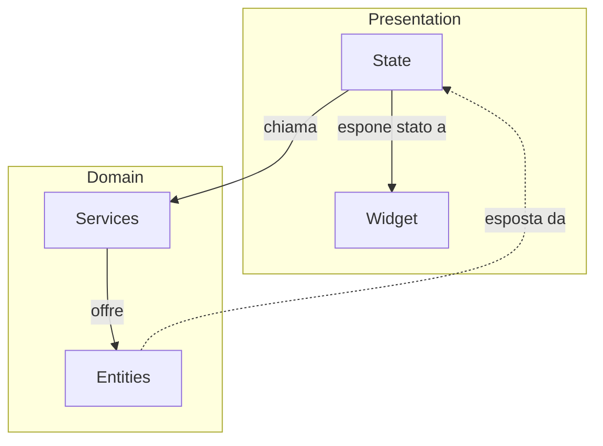

# Presentation Layer

Il nostro _deliverable_.

<!--
  Ok, ancora un po' di pazienza. Vediamo ancora un po' di teoria assieme.

  Di fatto, non abbiamo parlato di architettura pulita. Proviamo a dare un senso pratico alla teoria.

  Il prodotto che costruiamo spesso viene valutato sulla base di questo strato. 
  
  Quindi è prioritario sviluppare il Presentation Layer agevolmente, senza problemi.

-->
