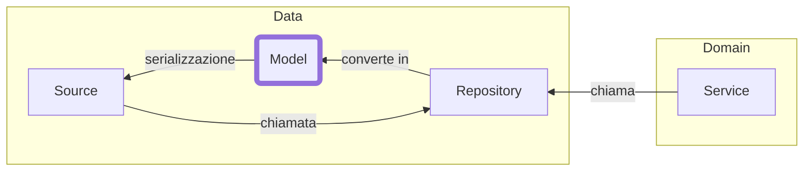

# Il Data Layer
Tutto ciò che arriva "da fuori"

<!-- 
Il Data Layer ha una responsabilità molto grande: deve prendere una sorgente di dati esterna
e convertirla in un oggetto che qui chiamo Model che rappresenta l'outcome di tale sorgente.

Descrivere questo task è semplice (e viene fatto dalla repository):
  1. serializzo una richiesta, se c'è
  2. chiamo una sorgente dati (e.g. REST API)
  3. de-serializzo il risultato

Nel concreto però è in questo layer che emergono più ostacoli e soprattutto eccezioni.

Ecco in questo """talk""" non parleremo di gestione degli errori, pena lo sforamento del tempo che abbiamo.

-->
